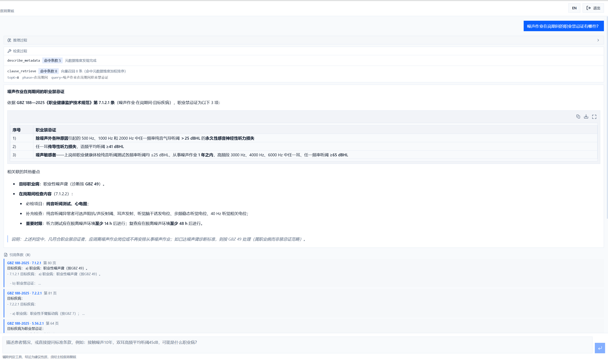

# 职业健康辅助判定系统

[](https://openjdk.org/projects/jdk/21/)
[](https://spring.io/projects/spring-boot)
[](https://baomidou.com/)
[](https://www.mysql.com/)
[](https://www.postgresql.org/)
[](https://github.com/pgvector/pgvector)
[](https://redis.io/)
[](https://nextjs.org/)
[](https://react.dev/)
[](https://www.typescriptlang.org/)
[](https://tailwindcss.com/)
[](docker-compose.yml)

## 为什么做这个



之前接过甲方的一个活，要检测大批的体检报告，判断其是否符合国标规定的职业病。

于是自然想到了给Agent塞一个metadata RAG，做了个MVP ，相比传统的检索和单纯的RAG，其效率和智能化程度，实在有点出乎我的意料。

索性把这个平台加以认真构建，希望他能作为一个有价值的项目帮助企业或有需要的个人落地。

附带探索时的一些性能实测，感兴趣的可以移步`docs\benchmark.md`参考不同方案所带来的性能提升.

## 它能做什么

- 把 200 余份国标/行标 Markdown 按"章-条-附录"切成条款入库，可查原文、可定位页码。
- 按危害因素（噪声、铅、苯、粉尘等）召回适用条款，支持语义检索、精确取回与引用展开。
- 录入体检数据后由 Agent 自主检索条款并给建议结论，附证据链与额外检查推荐。
- 上传报告图片自动抽取检查项，人工核对后写入体检记录（抽取仅为草稿，不自动采信）。
- 判定与对话过程可回放：调了哪些工具、用了什么过滤条件、命中哪条规则、花了多少 token，都有记录。

## 技术特点

1. **Agentic Metadata RAG**：条款库带结构化元数据（标准号/危害因素/检查阶段/检查类别/
   附录类型/页码），以工具形式暴露给模型（元数据发现/语义召回/精确获取/引用展开/危害路由）。
   模型自主决定查什么、用什么过滤维度、查几轮，而不是走写死的流程。
   实测同一查询下，元数据过滤把 Top-5 精确率从 0.480 提到 1.000（见 `docs/benchmark.md`）。
2. **Agent 判定 + 规则下限**：判定由模型自主编排，但规则引擎结论是不可下调的安全下限
   （`rule/ConclusionPolicy`）。模型可上调结论（发现问题），不可下调；被拦截时留痕，
   模型不可用则回退纯规则结论，接口不抛穿。
3. **抽取与判定分离**：报告图片抽取只产出草稿，必须经人工核对（`report_upload_items.confirmed`）
   才能进入体检记录，模型输出永不自动进入判定链路。

## 后端实现（需求 → 方案 → 代码位置）

| 模块           | 需求                          | 方案                                                                                   | 代码位置                                                                                |
| -------------- | ----------------------------- | -------------------------------------------------------------------------------------- | --------------------------------------------------------------------------------------- |
| IoC/DI         | 全项目依赖注入                | 构造器注入，工具接口化                                                                 | `rag/ClauseRetrievalTools.java`                                                       |
| AOP            | 审计日志与接口耗时统计        | `@AuditLog` 注解 + `@Around` 切面                                                  | `common/AuditLogAspect.java`                                                          |
| 声明式事务     | 判定落库多表写入同一事务      | `@Transactional` 包裹评估+证据+推荐                                                  | `service/AssessService.java`                                                          |
| 事务边界正确性 | 导入服务内部调用致事务失效    | 经自身代理调用单文件导入，保证注解生效                                                 | `service/StandardImportService.java`                                                  |
| MyBatis-Plus   | 条款分页与条件查询            | Wrapper 简单查询，复杂 SQL 放 XML                                                      | `mapper/*`、`controller/AssessController.java`                                      |
| MySQL 索引     | 条款按标准号+条款编号高频查询 | 联合唯一索引`(standard_code, clause_no)`，EXPLAIN 实测见 `docs/benchmark.md` §4.3 | `db/migration/mysql/V1__base_tables.sql`                                              |
| PG 向量索引    | 元数据过滤与向量检索加速      | 过滤维度建表达式索引；向量检索改两段式以命中 HNSW                                      | `db/migration/postgresql/V2__vector_index_tuning.sql`、`rag/ClauseVectorStore.java` |
| Redis 缓存     | 条款热点查询与元数据发现      | `HotCache` cache-aside：一级进程内 + 二级 Redis，覆盖穿透/击穿/雪崩                  | `common/HotCache.java`                                                                |
| 幂等           | 判定提交防重复                | `Idempotency-Key` 头 + Redis 原子占位 + 请求哈希比对                                 | `common/IdempotencyAspect.java`                                                       |
| 并发线程池     | 批量判定并发执行              | 判定池 4/8/200、批量池 2/4/100，IO 密集取值，CallerRuns 拒绝策略                       | `config/ThreadPoolConfig.java`                                                        |
| 并发编排       | 向量入库与批量判定            | `CompletableFuture` + `Semaphore` 限流 + 原子计数 + `orTimeout`                  | `rag/ClauseRetrievalTools.java`、`service/BatchTaskService.java`                    |
| 原子抢占       | 批量任务多节点防重复执行      | 条件更新`WHERE status='PENDING'` 按影响行数判断归属                                  | `mapper/BatchTaskMapper.java`                                                         |
| 分布式锁       | 批量任务防重复执行            | Redis SETNX + 过期 + Lua 原子比对 token 释放                                           | `service/DistributedLock.java`                                                        |
| 校验与全局异常 | 统一错误体                    | JSR-303 +`@RestControllerAdvice`，错误码表进文档                                     | `common/GlobalExceptionHandler.java`、`common/ErrorCode.java`                       |
| 拦截器与过滤器 | 登录鉴权与链路追踪            | Sa-Token 拦截器 + traceId 过滤器贯穿 MDC                                               | `config/SaTokenConfig.java`、`common/TraceIdFilter.java`                            |
| 异步任务       | 批量评估异步执行              | 数据库任务表 +`@Scheduled` 轮询，不引入 MQ（见 ADR-02）                              | `service/BatchTaskService.java`、`docs/adr/0002-batch-task-table.md`                |
| 多模态抽取     | 报告图片结构化                | `LlmGateway.completeWithImages` + 人工核对表 + 确认入库                              | `service/ReportExtractionService.java`、`service/ReportUploadService.java`          |

补充说明：

- Agent 判定与规则下限的协作口径见 `docs/rag-design.md` §7–8；检索精确率、索引、缓存、
  并发实测数据见 `docs/benchmark.md`；测试分层与运行方式见 `docs/test-strategy.md`；
  踩过的坑与排查手法见 `docs/troubleshooting.md`。
- Sa-Token 会话存 Redis（`sa-token-redis-jackson`），后端重启不掉登录态。
  需要 Redis **6.0+**：Sa-Token 写入会话时用 `SET ... KEEPTTL`，该参数 6.0 才引入。
  `docker-compose.yml` 用的 `redis:8-alpine` 满足要求；若自行部署，请确认版本。
- 向量存储：`halfvec(1024)` + HNSW（pgvector 0.8.1 `vector` 类型索引上限 2000 维，
  4096 维无法建索引，故用兼容接口 `dimensions=1024` 参数降维，见 `docs/rag-design.md` §4）。

## 快速启动

### 方式一：Docker Compose 起依赖（推荐首次部署）

```bash
# 一键起 MySQL + PostgreSQL/pgvector + Redis（见 docker-compose.yml）
docker compose up -d
docker compose ps          # 等三个服务都变成 healthy
```

### 方式二：连接本机已装好的服务

本机已装并运行 MySQL / PostgreSQL / Redis 时无需 Compose，
应用默认就连 `127.0.0.1` 的默认端口，直接启动即可。

### 启动应用

```bash
# 1. 配置环境变量（复制 .env.example，填入两个模型密钥）
$env:LLM_API_KEY="你的对话模型密钥"; $env:EMBEDDING_API_KEY="你的向量模型密钥"
# 2. 启动后端 + 前端
cd server && mvn spring-boot:run
cd client && npm install && npm run dev
```

- 建库由 Compose 自动完成；表结构由应用启动时的 Flyway 迁移创建，无需手工建表。
- 后端：http://127.0.0.1:8080/api/v1，文档：`/doc.html`，默认账号 `admin / 1009`（自建后请第一时间重置）。
- 前端：http://127.0.0.1:3000（经 `/backend` 转发后端）。
- 标准文档需自行准备后放入 `data-markdown/`（仓库默认不带数据，见 `.env.example` 说明），
  再调 `POST /admin/standards/import` 解析入库、`POST /admin/rag/embed?batchSize=16&limit=6000` 建向量。

## 设计取舍

- **Agent 编排 + 规则下限**：结论须可复现可审计，纯模型输出不稳定且无证据链；
  但检索路径交给模型能覆盖多标准交叉的场景。故用规则结论守住下限，
  模型自由检索、只可上调结论，全程留痕。
- **自编排模型网关而非现成框架**：模型调用与 Agent 编排都基于 JDK `HttpClient` 手写。
  原因是协议层有几处框架抽象覆盖不到或不够透明：`reasoning_effort` 需经 `extra_body` 透传、
  SSE 里推理增量与正文增量要分别处理、`tool_calls` 是按 index 分片累积需自行归并。
  向量存取同理，直接基于 PostgreSQL + pgvector 写 SQL（两段式查询以命中 HNSW）。
  链路完全可控，而且当前使用的OpenAI completions标准在很长一段时间内可以保持稳定和通用性。
- **四类结论必须溯源**：定义源自 GBZ 188 第 4.8.2.2 条，写死在枚举里，
  每条结论至少一条款一数值，无证据不得下结论。

## 免责声明

本系统为辅助判定工具，非医疗诊断，结论为建议性质，必须经主检医师复核签字后生效。
界面与报告显著标注"须经主检医师复核"，不出现确诊类表述。
机构自加建议带 `is_extended=true` 并与标准内推荐分开展示。

## 仓库结构

```
server/  后端（Spring Boot 3.5 + MyBatis-Plus + Sa-Token + JDK HttpClient 自研模型网关）
client/  前端（Next.js 16 + React 19 + Tailwind v3 + next-intl + Streamdown）
docs/    设计文档与实测数据（rag-design / benchmark / test-strategy / troubleshooting）、ADR
```
